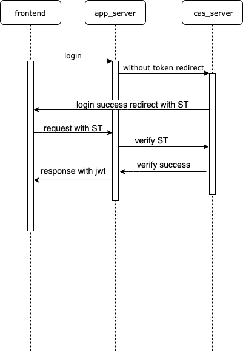

# SSO单点登陆实现

## 整体实现
* 使用cas的方案([官网](https://apereo.github.io/cas/4.2.x/protocol/CAS-Protocol.html))

### 细节问题
* sso第一次登陆时生成ST的同时，需要返回sso服务端的session。
* 服务端之间使用基于pb的rpc通信
### 团队需求特化
* 团队定期需要招新，参与招新的同学账号只能访问特定的服务，这里暂时将用户的默认权限都设置为最小权限
## 具体技术实现
### SSO-HTTP
* 可配置性
  * 配置可访问的域
  * 数据库的地址和密码
  * 